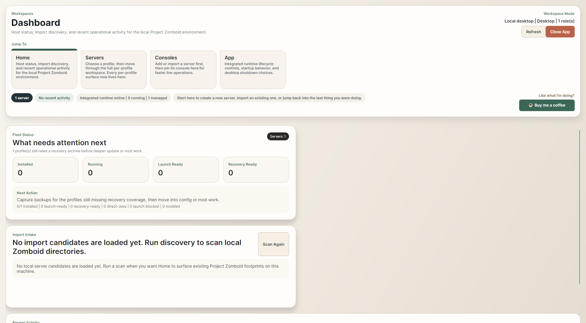
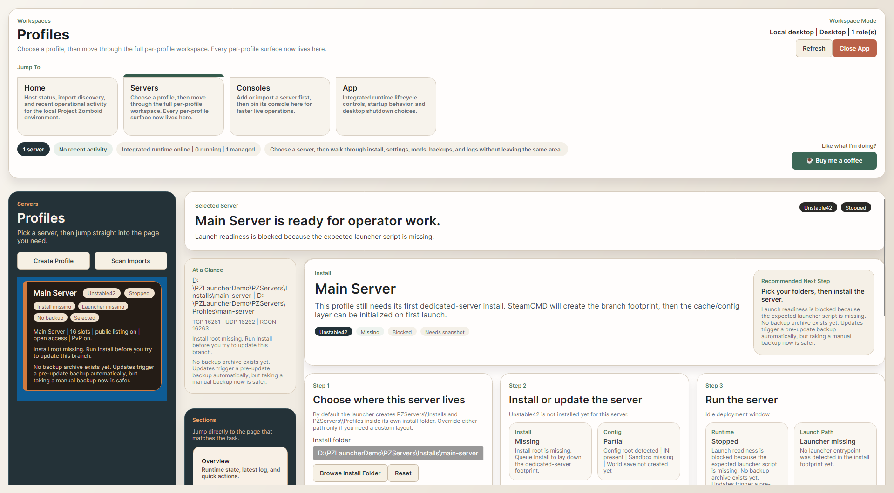
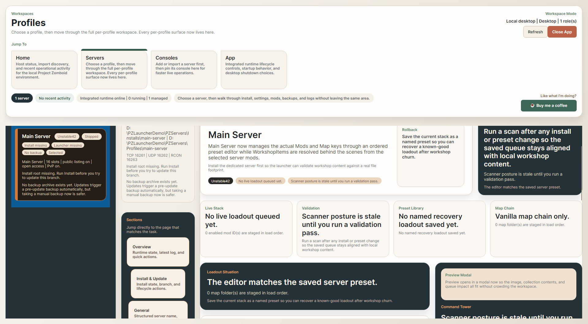
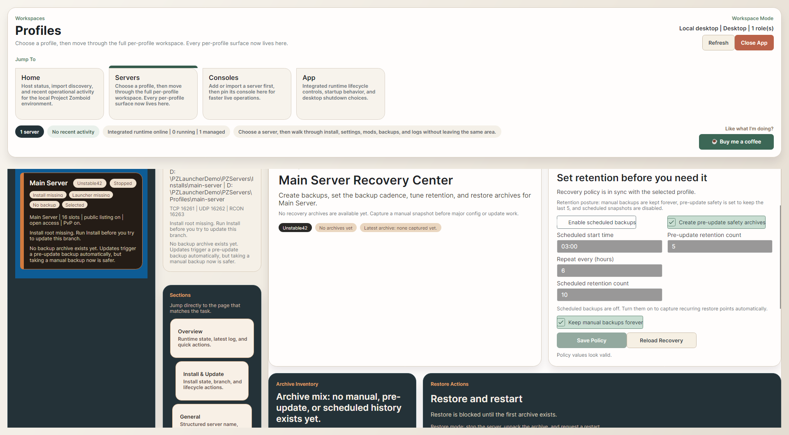

# PZServerLauncher

PZServerLauncher is a Windows desktop app for installing, configuring, backing up, and running Project Zomboid dedicated servers from one place.

> Quick links:
> - [Download the latest Windows installer](https://github.com/Bentheck/PZServerLauncher/releases/latest/download/PZServerLauncher.Setup.msi)
> - [View all releases](https://github.com/Bentheck/PZServerLauncher/releases)
> - [Latest release notes](https://github.com/Bentheck/PZServerLauncher/releases/latest)

## What It Helps You Do

- Install or update the Project Zomboid dedicated server with SteamCMD from the launcher.
- Create multiple server profiles with their own RAM, player count, ports, settings, and save data.
- Tune server settings, sandbox rules, mods, maps, network access, and admin controls without jumping between raw files.
- Capture manual or scheduled backups before risky changes, then restore when something goes sideways.
- Watch logs and keep live server consoles close at hand.

## Quick Start

1. Download and install the launcher with the MSI above.
2. Open **PZServerLauncher** and click **Create Profile**.
3. Choose a server name, base port, RAM amount, and max players, or keep the defaults for the normal setup.
4. Open **Servers > Install & Update** and confirm where the server should live.
5. Click **Install** to download the dedicated server.
6. Move through **General**, **Sandbox**, **Mods & Maps**, and **Network & Admin** to finish setup.
7. Open **Backups** and capture a restore point before major updates or mod changes.
8. Start the server and use **Consoles** or **Logs** to watch it live.

If you already have a local dedicated server on disk, use **Scan Imports** instead of starting from scratch.

## How The Launcher Is Organized

### Home

Use the dashboard for a quick read on host status, import discovery, and what needs attention next.

### Servers

This is the main workspace for day-to-day server management. After you pick a profile, the launcher breaks work into clear sections:

- **Overview**: runtime status, latest log posture, and quick operational context.
- **Install & Update**: install or update the server, change folders, uninstall the managed server, or delete the profile.
- **General**: core server identity, world basics, ports, and launcher runtime settings.
- **Sandbox**: apply presets or fine-tune world rules in detail.
- **Mods & Maps**: manage enabled mod order, map chain, workshop validation, and preset recovery.
- **Network & Admin**: passwords, RCON, public listing, anti-cheat, and admin bootstrap.
- **Backups**: manual backups, scheduled backups, retention, and restore.
- **Logs / Advanced Files**: live diagnostics and raw file access when you need it.

### Consoles

Use the consoles workspace to keep live server windows pinned and easy to revisit.

### App

Use the app workspace for startup behavior and desktop runtime / close behavior.

## Default Folder Layout

By default, launcher-managed servers live under the launcher install folder:

- `PZServers\Installs`
- `PZServers\Profiles`

You can override those paths per profile if you need a custom layout, but the normal path is ready to go out of the box.

## Screenshots

### Dashboard

See host status, import discovery, and the next action to take.

### Install And Update

Install the dedicated server, review branch posture, and launch from the same workspace.

### Mods And Maps

Keep the active mod order clean, validate workshop content, and recover known-good presets.

### Backups

Create restore points, set retention, and bring a server back quickly when needed.

## Good To Know

- The launcher is desktop-first and built for Windows.
- You do not need to manually unpack the dedicated server before using it. The launcher can install it for you.
- Shipped sandbox preset files are bundled with the app, so preset selection works on a fresh launcher install too.

